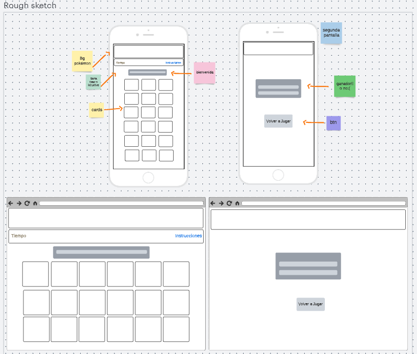
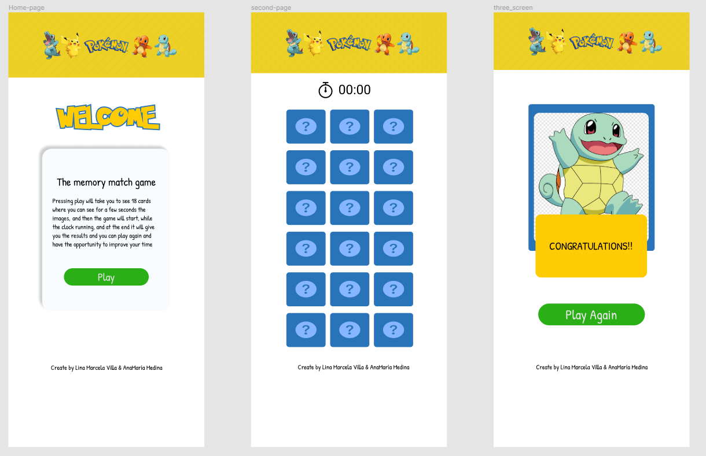
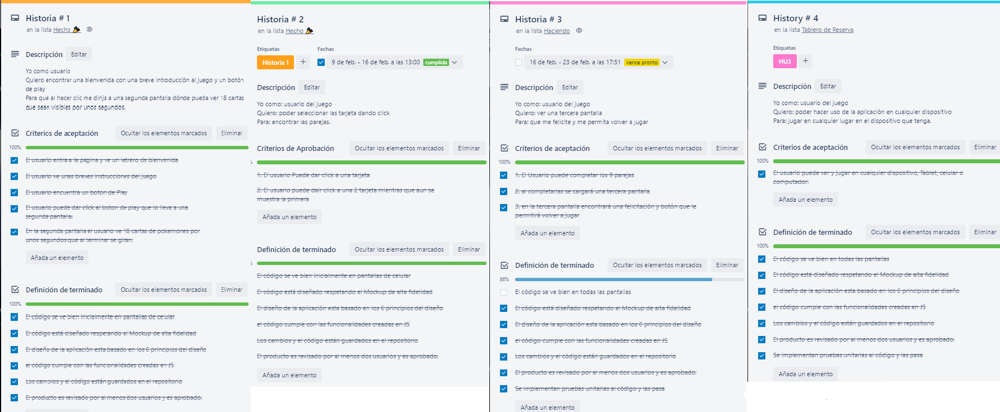
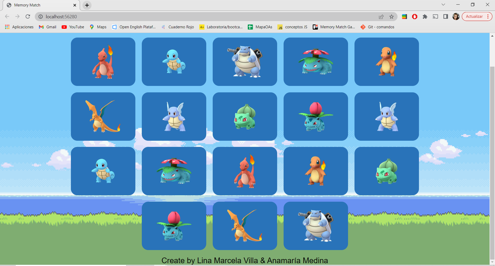
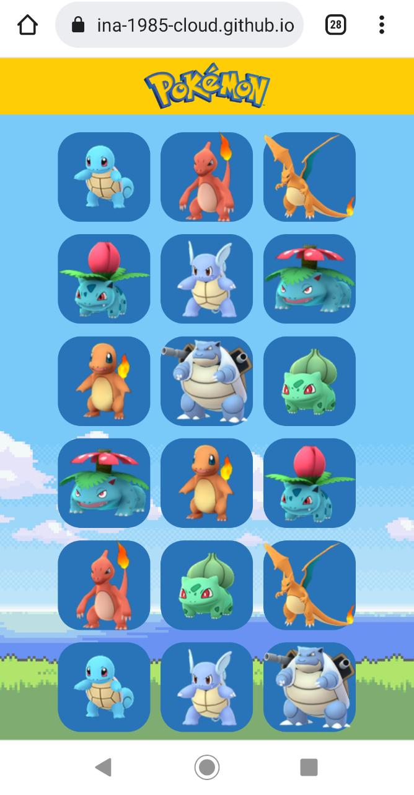

# Memory Match Game Pokemon

## Indice

* [1. Definición del Producto](#1-preámbulo)
* [2. Prototipos del Juego](#2-resumen-del-proyecto)
* [3. Historias de Usuario](#3-objetivos-de-aprendizaje)
* [4. Responsive](#4-consideraciones-generales)
* [5. Pruebas unitarias](#5-criterios-de-aceptación-mínimos-del-proyecto)

***

## 1. Definición del producto

Para la elaboración de la definición del producto primero se tomó como base la idea de diseñar un juego de memoria
con temática de Pokémon, teniendo esta primera definición se le realizo a un grupo poblacional de 10 personas 
de 10 a 60 años una encuesta para entender que y como les interesaba ver el juego. 

Teniendo los resultados arrojados en la encuesta se definió el producto de la siguiente manera: 

Este proyecto está dirigido a niños mayores de 10 años y adolescentes amantes de los Pokémon, 
o que simplemente les gusta desafiarse a sí mismos con juegos de memoria. Hay 18 tarjetas con 
diferentes imágenes que permitirán al usuario ver por unos pocos segundos la ubicación de estas,
luego darán la vuelta y el juego comenzará haciendo clic en ellas. Sólo puede hacer clic en dos cartas, 
si son iguales se revelarán, de lo contrario, darán vuelta hasta encontrar la pareja respectiva.
Cuando termine el juego y el jugador encuentre todas las parejas, será anunciado como el ganador. 
El usuario tiene la posibilidad de volver a jugar, encontrando siempre las imágenes en posiciones diferentes.

## 2. Prototipos

#### Prototipo de baja fidelidad

Para la elaboración del prototipo se uso la herramienta Lucid en la cual se desarrollaron inicialmente
dos pantallas, una en la que se inicia el juego y otra en la que se da la felicitación y se permite con 
un botón reiniciar el juego, este diseño fue mostrado al grupo poblacional entrevistado para recopilar la información necesaria sobre los cambios y diseño necesarios para entregar un producto adecuado 
a las necesidades de los clientes.  

#### Prototipo de alta fidelidad

Finalmente usando los fundamentos del diseño visual, con ayuda de la herramienta [Figma](https://www.figma.com/) y teniendo en cuenta las 
observaciones presentadas por los usuarios, se definió un prototipo de alta fidelidad donde encontramos 3 pantallas, una que indica de
que se trata el juego y con un botón de jugar nos lleva hacia la segunda pantalla donde se desarrolla el juego y una tercera pantalla que 
aparecerá cuando el jugados haya completado el juego donde se le felicitara y con un botón de volver a jugar que le dará la oportunidad de reiniciar un nuevo juego completamente diferente. 

## 3. Historias de Usuario
Con la ayuda de la herramienta Trello que nos ayudo a organizar nuestras tareas y tiempo definimos para el desarrollo del proyecto 
4 Historias de Usuario basadas en el diseño del producto, las cuales fueron distribuidas a lo largo de 4 Sprint para lograr completar 
totalidad de las tareas que presentaba el desarrollo del juego. 

En la definición de las historias de usuario tuvimos en cuenta la estructura inicial de: “Yo como usuario”, “Quiero”, “Para”. Y se 
definieron Los “Criterios de Aceptación” así como la “Definición de Terminado” para poder definir unas excelentes Historias de Usuario que nos permitieran llevar cada Historia a la culminación de la manera mas eficiente, entregando en cada Sprint una parte del producto funcional. 

## 4. Responsive
Cumpliendo los objetivos del proyecto el juego fue desarrollado para que funcione de manera eficiente en cualquier tipo de pantalla por 
como lo podemos ver en las siguientes imagenes.

 

## 5. Pruebas Unitarias

Para concluir el desarrollo de la aplicación, se crearon dos pruebas unitarias para probar don puntos importantes del desarrollo del mismo
los cuales eran la impresion del tablero en la estructura HTML asi como la impresion de las 18 tarjetas traidas de la Data, estas pruebas 
fueron positivas. 

